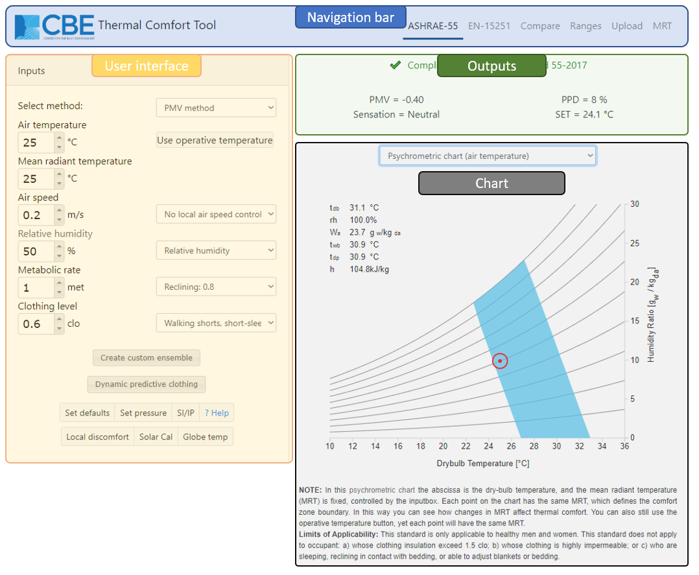

# ASHRAE 55

This web-based tool for thermal comfort calculations according to ASHRAE Standard 55-2020 is developed at the University of California at Berkeley. Its aim is to provide a free, cross-platform tool that allows designers and other practitioners to perform thermal comfort calculations. See the bottom of the web page for acknowledgments, contact information, and citation.

This guide aims to explain the main features of the tool and demonstrate how best to use it. In most cases, the interface is intuitive and does not require explanation. To get information quickly, click on an input header to be directed to a Wikipedia article relevant to that specific input.

## Main interface

The tool has three main parts:

* **Left-hand side**: The input section allows you to change all the parameters used to calculate the thermal comfort indices. You can either change the value of each parameter by typing a new value in the respective box or by using the up and down arrows. You can click on the `Save` button to save the current inputs, `Reload` to reload the inputs that you have previously saved, `Share` to share the page \(as it appears on the screen\) via a link, `Reset` to reset the input values to the default value. The functionalities of the other buttons in the input section are explained in detail below.
* **Top-right**: This section contains the results of the calculations. The raw output of the comfort model calculations \(such as PMV, PPD, etc. for the PMV method\) as well as compliance information.
* **Bottom-right**: This section contains a visualization of the thermal comfort conditions in the input. There are currently three types of charts visualizing the thermal comfort region, as follows:
  * Psychrometric \(plotted using either the dry-bulb air temperature or the operative temperature\)
  * Relative humidity vs. dry-bulb air temperature.
  * Airspeed vs. operative temperature.
  * Thermal heat losses vs. dry-bulb air temperature. This chart shows the total heat losses per unit area as calculated by the PMV method. By default, the chart is showing only the total heat losses of the human body \(latent, sensible as well as their cumulative value\) and the metabolic rate. The intersection between the metabolic rate line \(constant\) and the total heat losses line is the neutral temperature at which the human body is in thermal balance with the surrounding environment. You can toggle on and off other lines, depicting different heat loss components, by clicking on the respective label in the legend.
  * Operative indoor air temperature vs. prevailing mean outdoor temperature \(Adaptive comfort region\).

## Comfort models

At the top of the user interface, you can choose between the two methods allowed by the standards, which are the PMV/PPD method and the Adaptive method. For airspeeds greater than 0.2 m/s \(39.4 fpm\) the PMV calculations employ the elevated airspeed method, which calculates and reports the cooling effect of the air movement. For more information about the comfort models, you can follow the link to Wikipedia by clicking on 'select method'.

### Predicted Mean Vote \(PMV\)

For more information about the PMV model visit [this page](pmv.md), below a video explaining how to calculate PMV and PPD using the CBE thermal comfort tool.



### Adaptive method

By choosing the Adaptive method at the very top of the user interface, the chart changes and the input variables include air temperature, mean radiant temperature, and prevailing mean outdoor temperature. This is because the personal factors and humidity are not significant in this method since adaptation is considered, and the only variable is the outdoor temperature. See above for an explanation of the first two variables, air and mean radiant temperature.



**Prevailing mean outdoor temperature**

Here you can type the outdoor temperature averaged as explained on the standard. See the Wikipedia link for a brief explanation. Changing this variable makes the dot representing the current condition move horizontally. The meaning of this chart is that certain conditions of indoor-outdoor temperature fall inside the comfort zone, which in this case is static.

**Airspeed**

In the Adaptive method, air movement can be used under certain conditions to widen the comfort zone, allowing higher indoor operative temperatures. You can select the value and see how it changes the upper boundaries of the 80% and 90% acceptability zones.

## Additional Features

At the bottom of the input section of the tool, you can find more clickable buttons to set more parameters and open some dialogs.

### Solar gains on occupants

Converts solar gain \(i.e. direct, sky-diffuse, and ground-reflected shortwave radiation\) to the equivalent delta mean radiant temperature.



### Dynamic Predictive Clothing

According to an addendum of the Standard, clothing insulation can be predicted by knowing the outdoor air temperature at 6 a.m. of the day in question. By opening this tab, you will be able to type such temperature, based on measurements or a weather file, and feed it to an equation that will automatically update the value in the clo input box, and update the comfort zone according to this change.

### Globe temperature calculator

Clicking on this button, a new window pops up, letting you type the following inputs: air temperature, air speed, globe temperature, globe diameter, globe emissivity, to calculate the correspondent Mean Radiant Temperature, that can be set as the current value by clicking the 'set' button. This feature allows you to have a more precise evaluation of the MRT by taking measurements with a globe thermometer. The button is disabled when the operative temperature is used.



### Set pressure

You can change the barometric pressure to account for changes in altitude. The standard atmospheric pressure is 1 atm = 101.325 kPa = 101325 Pa. Remember to input the value in Pascals!

### Reset, Save, Reload, and Share

* Reset - all inputs to their default values.
* Save - the current input values.
* Reload - the saved input values.
* Share - creates a link that can be used to share the current page.

### SI/IP

Click on this button to switch between the International System of Units \(SI\) and the Inch-Pound system.

### Local thermal discomfort

Even though the comfort model based on PMV/PPD describes compliance to thermal comfort for the body as a whole, thermal dissatisfaction may also occur just for a particular part of the body due to local sources of unwanted heating, cooling, or air movement. This feature allows you to verify the compliance of the space to the Standard as regards local thermal discomfort. By feeding the tool with measurements of air temperature in particular zones surrounding the occupant, you can see whether the discomforting effect in the space is likely to exceed the ASHRAE-55 acceptability limits. Draft at the lower leg region may occur in the buildings conditioned by thermally stratified systems, such as displacement ventilation and underfloor air distribution, or with cold-dropping airflow along external walls and/or windows. An ankle draft risk model, based on the work of by [Liu et al. \(2017\)](https://escholarship.org/uc/item/9076254n) and [Schiavon et al. \(2016\)](https://escholarship.org/uc/item/4p692575), has been implemented in the tool. This model can evaluate the predicted percentage dissatisfied on draft at ankle level \(PPD AD\) as a function of PMV and airspeed at the ankle. Regarding the usage of the ankle draft risk model, the subject's metabolic rate and clothing level should be kept below 1.3 met and 0.7 clo, respectively. The airspeed on the upper body is fixed as 0.2 m/s for PMV calculation in the ankle draft risk model since a condition of airspeed higher than 0.2 m/s should refer to the elevated air speed model instead. Change the values in the input boxes according to your measurements. A checkmark will appear next to each section, while a general compliance message will be shown at the bottom of the dialog. Remember that to comply with the Standard all the sections must respect the limits.



