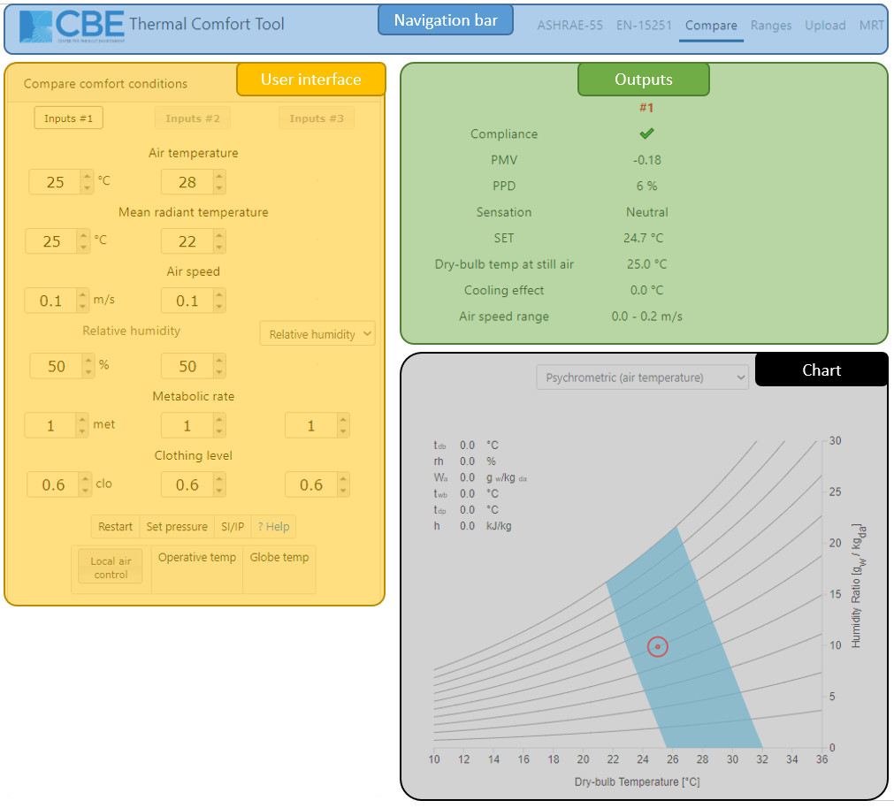

# Compare

This page explains how to use the compare tool. In most cases, the interface is intuitive and does not require explanation. To get information quickly, click on the input headers to be directed to a Wikipedia article relevant to that input. In addition, the video-tutorial below explains how to use the Compare tool.



## Getting Started

### Main interface

The tool has three main parts:

* **Left-hand side**: This section is the user interface. It contains the input fields containing values that drive the comfort calculations and visualizations. To change these input values, you can type directly in the boxes or click on the up and down arrows. There are also several other buttons, their functionality is explained in detail below.
* **Top-right**: This section contains the results of the calculations. The raw output of the comfort model calculations \(such as PMV, PPD, etc. for the PMV method\) as well as compliance information.
* **Bottom-right**: This section contains a visualization of the thermal comfort conditions in the input. There are currently three types of charts visualizing the thermal comfort region, as follows:
  * Psychrometric \(plotted using either the dry-bulb air temperature or the operative temperature\)
  * Relative humidity vs. dry-bulb air temperature.

## Comfort model

### Predicted Mean Vote \(PMV\)

For more information about the PMV model visit [this page](pmv.md).

## Additional Features

At the bottom of the input section of the tool, you can find more clickable buttons to set more parameters and open some dialogs.

### Globe temperature calculator

Clicking on this button, a new window pops up, letting you type the following inputs: air temperature, air speed, globe temperature, globe diameter, globe emissivity, to calculate the correspondent Mean Radiant Temperature, that can be set as the current value by clicking the 'set' button. This feature allows you to have a more precise evaluation of the MRT by taking measurements with a globe thermometer. The button is disabled when the operative temperature is used.



### Set pressure

You can change the barometric pressure to account for changes in altitude. The standard atmospheric pressure is 1 atm = 101.325 kPa = 101325 Pa. Remember to input the value in Pascals!

### Reset

This button sets some default values for all the input variables, to restart the calculation and visualization.

### SI/IP

Click on this button to switch between the International System of Units \(SI\) and the Inch-Pound system.

### Operative temperature

Operative temperature can be selected as an input. This will hide the air temperature and mean radiant temperature input boxes.

### Local air control

You can select this button when the occupants have control of the air movement, e.g. if they can operate a fan and set its intensity.

