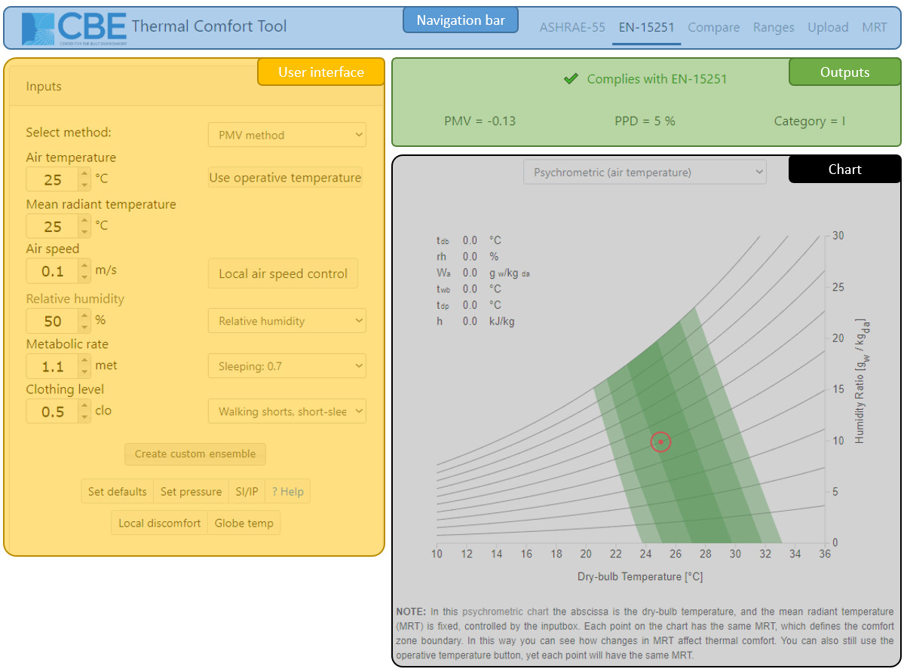

# EN-16798

This web-based tool for thermal comfort calculations according to EN 16798-1:2019 Standard is developed at The University of California at Berkeley. Its aim is to provide a free, cross-platform tool that allows designers and other practitioners to perform thermal comfort calculations. See the bottom of the web-page for acknowledgments, contact information, and citation.

This guide aims to explain the main features of the tool, and demonstrate how best to use it. In most cases, the interface is intuitive and does not require explanation. To get information quickly, click on the input headers to be directed to a Wikipedia article relevant to that input.

## Getting Started

### Main interface

The tool has three main parts:

* **Left-hand side**: This section is the user interface. It contains the input fields containing values that drive the comfort calculations and visualizations. To change these input values, you can type directly in the boxes or click on the up and down arrows. There are also several other buttons, their functionality is explained in detail below.
* **Top-right**: This section contains the results of the calculations. The raw output of the comfort model calculations \(such as PMV, PPD, etc. for the PMV method\) as well as compliance information.
* **Bottom-right**: This section contains a visualization of the thermal comfort conditions in the input. There are currently three types of charts visualizing the thermal comfort region, as follows:
  * Psychrometric \(plotted using either the dry-bulb air temperature or the operative temperature\)
  * Relative humidity vs. dry-bulb air temperature.
  * Operative indoor air temperature vs. prevailing mean outdoor temperature \(Adaptive comfort region\).

## Comfort models

At the top of the user interface you can choose between the two methods allowed by the standards, which are the PMV/PPD method and the Adaptive method. For more information about the comfort models, you can follow the link to Wikipedia by clicking on 'select method'.

### Predicted Mean Vote \(PMV\)

For more information about the PMV model visit [this page](pmv.md).

### Adaptive method

By choosing the Adaptive method at the very top of the user interface, the chart changes and the input variables include air temperature, mean radiant temperature and outdoor running mean temperature. This is because the personal factors and humidity are not significant in this method since adaptation is considered, and the only variable is the outdoor temperature. See above for explanation of the first two variables, air and mean radiant temperature.

#### Outdoor running mean temperature

Here you can type the outdoor temperature averaged as explained on the standard. See the Wikipedia link for a brief explanation. Changing this variable makes the dot representing the current condition move horizontally. The meaning of this chart is that certain conditions of indoor-outdoor temperature fall inside the comfort zone, which in this case is static.

#### Air speed

In the Adaptive method air movement can be used under certain conditions to widen the comfort zone, allowing higher indoor operative temperatures. You can select the value and see how it changes the upper boundaries of the 80% and 90% acceptability zones.

## Additional Features

At the bottom of the input section of the tool, you can find more clickable buttons to set more parameters and open some dialogs.

### Globe temperature calculator

Clicking on this button, a new window pops up, letting you type the following inputs: air temperature, air speed, globe temperature, globe diameter, globe emissivity, to calculate the correspondent Mean Radiant Temperature, that can be set as the current value by clicking the 'set' button. This feature allows you to have a more precise evaluation of the MRT by taking measurements with a globe thermometer. The button is disabled when the operative temperature is used.



### Set pressure

You can change the barometric pressure to account for changes in altitude. The standard atmospheric pressure is 1 atm = 101.325 kPa = 101325 Pa. Remember to input the value in Pascals!

### Reset

This button sets some default values for all the input variables, to restart the calculation and visualization.

### SI/IP

Click on this button to switch between the International System of Units \(SI\) and the Inch-Pound system.

### Local thermal discomfort

Even though the comfort model based on PMV/PPD describes compliance to thermal comfort for the body as a whole, thermal dissatisfaction may also occur just for a particular part of the body due to local sources of unwanted heating, cooling or air movement. This feature allows you to verify the compliance of the space to the Standard as regards local thermal discomfort. By feeding the tool with measurements of air temperature in particular zones surrounding the occupant, you can see whether the discomfort effect in the space is likely to exceed the ISO 7730 acceptability limits. Change the values in the input boxes according to your measurements. A checkmark will appear next to each section, while a general compliance message will be shown at the bottom of the dialog. Remember that to comply with the Standard all the sections must respect the limits.

