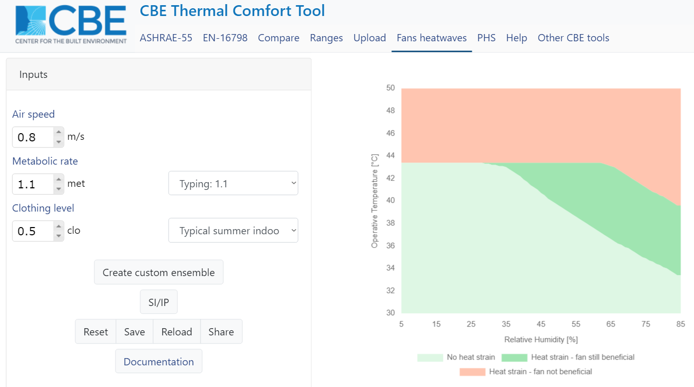

# Fans heatwaves

Electric fans are an affordable, sustainable and effective way to keep people cool. They are the most cost-effective cooling method for most applications. The CBE Thermal Comfort Tool uses the Gagge et al. \(1971\) two-nodes human energy balance model, to determine under which environmental \(air temperature, relative humidity, air speed and mean radiant temperature\) and personal \(metabolic rate, clothing\) conditions the use of fans is beneficial.

## Highlights

* Electric fans can safely be used even if the air temperature is higher than 35 °C.
* Electric fans cool people even when air temperature exceeds skin temperature.
* Health guidelines should not discourage people from using fans during heatwaves.
* Health guidelines regarding the use of electric fans should be reviewed.
* Our open-source tool calculates humidity-dependent temperature thresholds.

## Introduction

Increasing air movement is a personalized cooling strategy that bypasses the issues associated with refrigerant gases and is more efficient than compressor-based air conditioning \[1\]. Electric fans are relatively inexpensive, energy-efficient, some \(e.g., pedestal and desk\) do not have any installation cost, and with direct current motors, they now consume single-digit watts and provide substantial air flows \[2\]. Electric fans can be used either as an alternative cooling technology or in combination with a reduced level of compressor-based air conditioning \[1\].

However, the WHO states that if the dry-bulb air temperature \(tdb\) is higher than 35 °C fans can make an individual hotter, and "fans should be discouraged unless they are bringing in significantly cooler air". They also mention that when tdb is higher than 35 °C, fans may not prevent heat-related illness \[4\]. The underline assumption is related to the fact that if tdb exceeds skin mean temperature \(tsk\) \(approximately 35 °C\) the gradient for dry heat loss is reversed and sensible heat is added to the body. Ready.gov, a national public service campaign of the U.S. Government that aims to "educate and empower the American people to prepare for, respond to and mitigate emergencies, including natural and man-made disasters", states that electric fans should not be used when outside temperatures are higher than 35 °C \[5\]. According to Ready.gov, in these conditions electric fans could increase the risk of heat-related illness, and that they create airflow and a false sense of comfort, but do not reduce body temperature. The Centers for Disease Control and Prevention \(CDC\) states that when the temperature is in the high 90’s \(°F, i.e., above 32°C\) fans will not prevent heat-related illness \[6\]. Similarly, the EPA Excessive Heat Events Guidebook discourages directing the flow of fans towards the body when tdb is higher than 32.2 °C \[7\].

When the dry-bulb temperature is higher than skin temperature, the aforementioned recommendations undervalue the evaporative cooling impact of electric fans, ignoring empirical evidence showing healthy adults benefit from their use \[10, 18, 19, 20\]. Based on this evidence, advising healthy adults not to use fans when tdb exceed tsk or 35 °C could increase their risk of suffering from heat strain and would prevent them from using an effective, energy-efficient, and low-cost cooling technology.

## Fan Heatwaves Tool

The CBE Thermal Comfort - Fan Heatwaves tool estimates heat losses and physiological variables as a function of ambient and personal parameters using the human thermoregulatory model proposed by Gagge et al. \(1971\) \[11\]. These results are then utilized to calculate humidity-dependent temperature thresholds for healthy persons who use electric fans during heatwaves. The model's interface is depicted in the diagram below. The user can alter the input variables on the left side of the screen, while the results are displayed on the right side.

### Inputs

In the CBE Thermal Comfort tool we only allow users to change the following variables:

* air speed \(m/s\), 
* metabolic rate \(met\), and 
* clothing level \(clo\). 

We also assume that dry-bulb air temperature is equal to the mean radiant temperature.

If you would like to change any additional inputs \(e.g. external work, body position\) or the above-mentioned assumptions. We highly encourage you to use the function `use_fans_heatwaves()` which is included in the Python package `pythermalcomfort`. Please find out more about how to use the aforementioned function [here](https://pythermalcomfort.readthedocs.io/en/latest/reference/pythermalcomfort.html#use-fans-during-heatwaves).

### Outputs

The figures are updated in real-time using the results, which are derived automatically. We use a red backdrop to indicate when heightened air velocity can be utilized to cool the human body, while we use a green background to depict when electric fans should not be used. While the usage of fans is still advantageous in the dark green area, not all adult healthy individuals will be able to compensate for endogenous and external heat gains, resulting in heat stress. Because the greatest rate of evaporative heat loss from the skin \(W/m2\) is inversely related to Relative Humidity \(RH\), the maximum operative temperature at which heat strain is anticipated to occur lowers as the value of RH increases. At low RH, the slope of the heat stress curve flattens. The RH value at which the curve flattens is proportional to the air speed \(V\). This is due to the fact that at low RH levels, cutaneous blood flow reaches its maximum, creating heat strain.

## Limitations

The Gagge et al. \(1971\) heat balance model employs experimentally derived coefficients and simplified equations \(e.g., to calculate the respiratory losses\). The results generated using the Gagge model are estimates for healthy and fit standard participants. The model does not forecast a single subject's physiological response, and the recommendations in this tool are not intended to replace professional medical advice. As a result, the findings may not apply to everyone, including people who have sweating problems owing to age, anticholinergic drugs, or other pre-existing diseases that interfere with thermoregulation. More empirical evidence is needed to confirm the model's applicability in diverse environments and to more vulnerable populations, such as the elderly. More evidence is needed, in particular, to evaluate the Gagge model's applicability in hot and dry conditions, i.e., RH less than 20% and tdb more than 40 °C. Because hyperthermia isn't the primary cause of death during extreme weather, hot and dry surroundings can aggravate cardiovascular strain by increasing epidermal blood flow \[1\]. While the Gagge adjusts for this, further laboratory-based research is needed to demonstrate that using a fan does not worsen cardiovascular strain in healthy persons in the situations stated above.

## Conclusions

During heatwaves, whether temperatures outside or inside exceed 35 °C, the public should not be recommended to stop using electric fans. As heatwaves become more frequent and intense as a result of climate change, public health recommendations for the usage of electric fans should be revisited in order to reduce heat-related illness and mortality.

## References

* \[1\] N. B. Morris, G. K. Chaseling, T. English, F. Gruss, M. F. B. Maideen, A. Capon, O. Jay, Electric fan use for cooling during hot weather: a biophysical modelling study, The Lancet Planetary Health 5 \(2021\) e368 e377. doi:10.1016/s2542-5196\(21\)00136-4.
* \[2\] B. Yang, S. Schiavon, C. Sekhar, D. Cheong, K. W. Tham, W. W. Nazaroff, Cooling efficiency of a brushless direct current stand fan, Building and Environment 85 \(2015\) 196{204. doi:10.1016/j.buildenv.2014.11.032.
* \[3\] O. Jay, R. Hoelzl, J. Weets, N. Morris, T. English, L. Nybo, J. Niu, R. de Dear, A. Capon, Fanning as an alternative to air conditioning { A sustainable solution for reducing indoor occupational heat stress, Energy and Buildings 193 \(2019\) 92{98. doi:10.1016/j.enbuild.2019.03.037.
* \[4\] WHO, Heat and health, [https://www.who.int/news-room/](https://www.who.int/news-room/) fact-sheets/detail/climate-change-heat-and-health, 2018. \(Accessed on 10/23/2020\). 
* \[5\] Ready, Extreme heat \| ready.gov, [https://www.ready.gov/heat](https://www.ready.gov/heat), 2020. \(Accessed on 11/05/2020\).
* \[6\] C. U. D. of Health, H. Services, Frequently asked questions \(faq\) about extreme heat \| natural disasters and severe weather \| cdc, https: //www.cdc.gov/disasters/extremeheat/faq.html, 2012. \(Accessed on 11/05/2020\). 
* \[7\] United States Environmental Protection Agency, Excessive Heat Events Guidebook, 2006
* \[8\] N. M. Ravanelli, S. G. Hodder, G. Havenith, O. Jay, Heart Rate and Body Temperature Responses to Extreme Heat and Humidity With and Without Electric Fans, JAMA The Journal of the American Medical Association 313 \(2015\) 724{725. doi:10.1001/jama.2015.153.
* \[9\] O. Jay, M. N. Cramer, N. M. Ravanelli, S. G. Hodder, Should electric fans be used during a heat wave?, Applied Ergonomics 46 \(2015\) 137{143. doi:10.1016/j.apergo.2014.07.013. arXiv:arXiv:1011.1669v3. 
* \[10\] D. Gagnon, S. A. Romero, M. N. Cramer, K. Kouda, P. Y. Poh, H. Ngo, O. Jay, C. G. Crandall, Age Modulates Physiological Responses during Fan Use under Extreme Heat and Humidity, Medicine and Science in Sports and Exercise 49 \(2017\) 2333{2342. doi:10.1249/MSS.0000000000001348
* \[11\] A. P. Gagge, A. P. Fobelets, L. G. Berglund, A standard predictive Index of human reponse to thermal enviroment, American Society of Heating, Refrigerating and Air-Conditioning Engineers \(1986\) 709{731.

