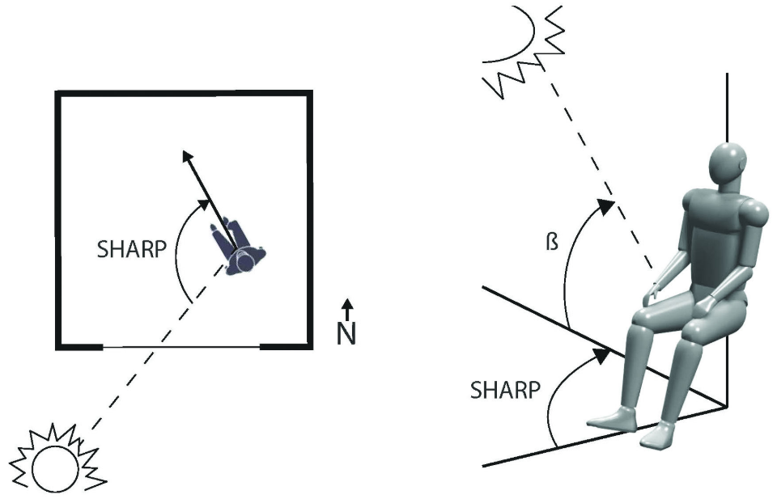
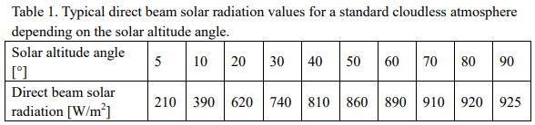
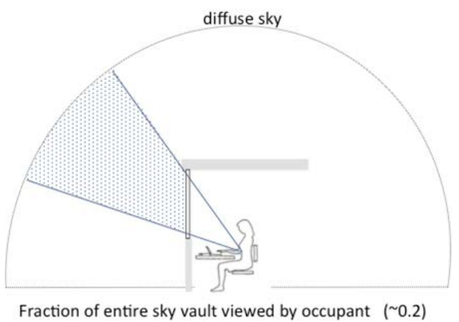
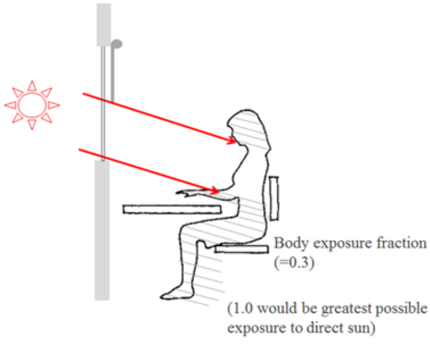

# SolarCal

Exposure to sunlight indoors produces a substantial effect on an occupant’s comfort and on the air conditioning energy needed to correct for it. It can be used to determine the allowable transmittance of fenestration in a perimeter office. Read the original research paper [here](https://escholarship.org/uc/item/89m1h2dg)

## Highlights

* SolarCal, a simplified whole-body model for the thermal comfort effects of shortwave solar radiation.
* SolarCal’s ability to predict the impact of solar radiation on occupant thermal comfort verified against lab study.

## Introduction

The solar heat absorbed and liberated in clothing and skin must be offset by cooler air and surface temperatures around the body for the occupant to remain comfortably in thermal balance. The SolarCal model is based on the effective radiant field \(ERF\), a measure of the net radiant energy flux to or from the human body. ERF is used to describe the additional \(positive or negative\) long-wave radiation energy at the body surface when surrounding surface temperatures are different from the air temperature. It is in W/m2 , where area refers to body surface area. The surrounding surface temperature of a space is commonly expressed as mean radiant temperature \(MRT\).

### Solar altitude, degrees

The angle between the sun’s rays and a horizontal plane. See Figure below.

### Solar horizontal angle relative to front of person \(SHARP\), degrees

The solar horizontal angle is symmetrical on both sides and ranges from 0 to 180 degrees in relation to the front of the person. Direct-beam radiation from the front is represented by zero \(0\) degrees, direct-beam radiation from the side is represented by 90 degrees, and direct-beam radiation from the back is represented by 180 degrees. The only angle between the sun and the human is SHARP. See Figure above.

### Direct beam \(normal\) solar radiation, W/m2

### Total solar transmittance of the window

The ratio of incident shortwave radiation to the total shortwave radiation passing through the glass and shades of a window system.

### Sky vault view factor

It ranges between 0 and 1.

### Fraction of the body exposed to sun

The percentage of the body not shaded by the window frame, interior or outside shading, or interior furnishings.

### Average shortwave absorptivity

The occupant's short-wave absorptivity will vary greatly based on the color of his or her skin, as well as the color and amount of clothing covering his or her body. Approximately equal to 0.67 for \(white\) skin and average clothing.

