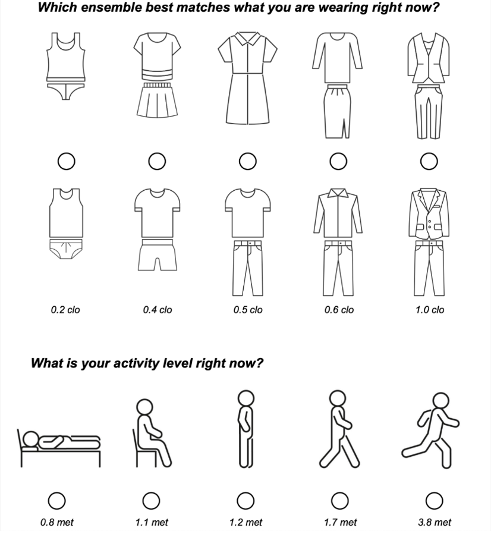

# Thermal comfort questions

These questions are based on Appendix L of ASHRAE 55 2023. ASHRAE 55 aims at achieving an 80% satisfied rating, but this is [rarely obtained](https://doi.org/10.5334/bc.76); typical thermal satisfaction levels are [around 40%](https://doi.org/10.5334/bc.76).&#x20;

According to ASHRAE 55, using occupant thermal environment surveys is an acceptable way of assessing comfort conditions. Surveys should strive for representative sample size and a high response rate. There are two types of thermal environment surveys, right-now and long-term.

**Right-now surveys** are used to evaluate occupants’ thermal experience at a single point in time. Suggested questions are shown below. They include (a) the _thermal sensation scale_, which asks occupants to rate their sensation (from “hot” to “cold”) on the ASHRAE seven-point thermal sensation scale. Votes values between –1.5 and +1.5 can be considered as “satisfied”; This is an assumption and directly using thermal satisfaction and preference gives, in our opinion, a more reliable result. (b) the _thermal satisfaction scale_ that directly asks how satisfied an occupant is and (c) the _thermal preference scales_ for temperature and air movement. This scale is very useful for the control of HVAC systems because it directly specifies what people want, this cannot be easily obtained from the thermal sensation scale.

<figure><figcaption></figcaption></figure>

Optional scales, that could be asked in some research context, are shown below:

<figure><figcaption></figcaption></figure>

Clothing and activity levels can be assessed using the following questions:

<figure><figcaption></figcaption></figure>

**Long-term surveys** are used to assess thermal comfort in most practical applications. These surveys provides “overall” or “average” comfort votes on their environment. They use the thermal satisfaction question (from “very satisfied” to “very dissatisfied”) on a seven-point satisfaction scale. The percentage of occupants satisfied should be calculated by dividing the number of votes falling between +1 and +3, inclusive, by the total number of votes. The percentage of occupants dissatisfied should be calculated by dividing the number of votes falling between -1 and -3, inclusive, by the total number of votes.

The thermal satisfaction survey can be used by researchers, building operators, and facility managers to assess building systems’ performance in new buildings, and to perform periodic post-occupancy evaluations in existing facilities.

<figure><figcaption></figcaption></figure>

<figure><figcaption></figcaption></figure>

According to ASHRAE 55, as the thermal satisfaction survey assesses a long timeframe, it should be administered every six months or repeated in heating and/or cooling seasons. In a new building, the first thermal satisfaction survey may be performed approximately six months after occupancy, late enough to avoid assessing the effects of building commissioning but early enough to help identify long-term building problems that have escaped detection in the commissioning process.

&#x20;

