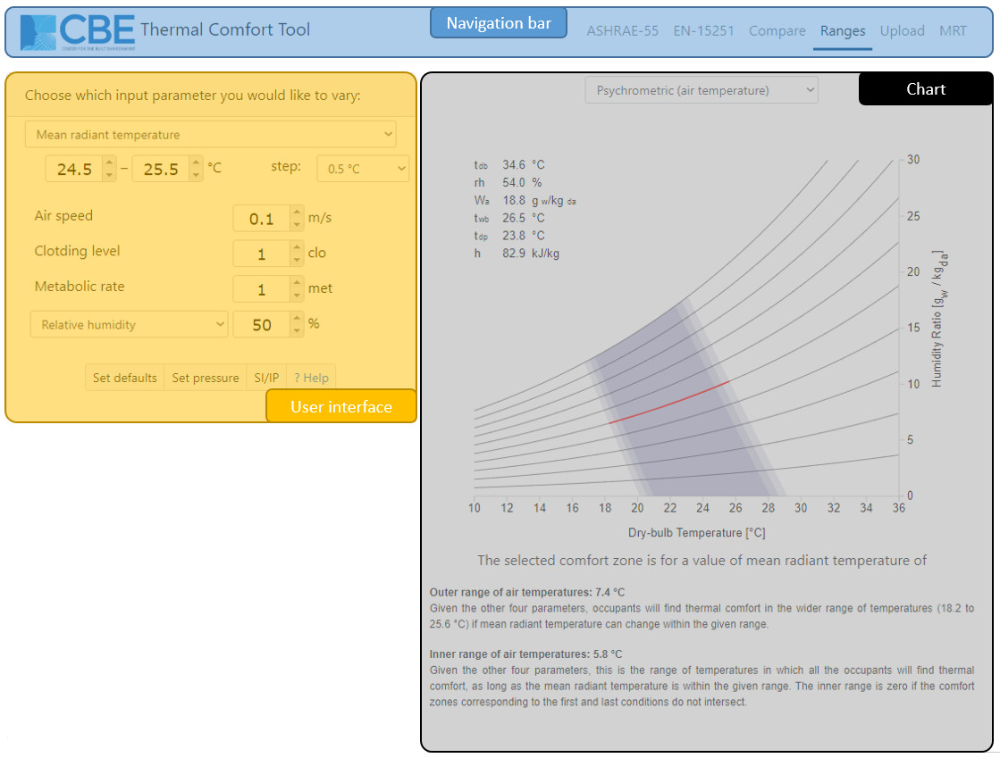

## Introduction

This page explains how to use the ranges tool. In most cases, the interface is intuitive and does not require explanation. To get information quickly, click on the input headers to be directed to a Wikipedia article relevant to that input. In addition the video-tutorial below explains how to use the Ranges tool.

<iframe width="560" height="315" src="https://www.youtube.com/embed/k2hmfJoF2dg" frameborder="0" allow="accelerometer; autoplay; encrypted-media; gyroscope; picture-in-picture" allowfullscreen></iframe>

## Getting Started

### Main interface

The tool has three main parts:
* **Left-hand side**: This section is the user interface. It contains the input fields containing values that drive the comfort calculations and visualizations. To change these input values, you can type directly in the boxes or click on the up and down arrows. There are also several other buttons, their functionality is explained in detail below.
* **Top-right**: This section contains the results of the calculations. The raw output of the comfort model calculations (such as PMV, PPD, etc. for the PMV method) as well as compliance information.
* **Bottom-right**: This section contains a visualization of the thermal comfort conditions in the input. There are currently three types of charts visualizing the thermal comfort region, as follows:
    * Psychrometric (plotted using either the dry-bulb air temperature or the operative temperature)
    * Relative humidity vs. dry-bulb air temperature.
    * Operative indoor air temperature vs. prevailing mean outdoor temperature (Adaptive comfort region).

## Comfort model

### Predicted Mean Vote (PMV)

There are six primary factors that affect thermal comfort. These include environmental conditions such as air temperature, and personal factors such as metabolic rate. In this page the PMV is calculated in compliance with the ASHRAE-55 method. For air speeds greater than 0.2 m/s (39 fpm) the PMV calculations employ the elevated airspeed method, which calculates and reports the cooling effect of the air movement.

#### Environmental factors

##### Dry-bulb air Temperature
By modifying this value, you will notice the output in the upper-right region changing, as well as the red dot on the psychrometric or temperature-humidity chart moving. This value corresponds to the x-axis of both charts. Depending on which specification of humidity is being used, the red dot may follow the lines of constant relative humidity, or move horizontally. This value does not affect the comfort zone itself, since the zone represents a range of air temperature and humidity values. Next to the air temperature box, you can click on the 'use operative temperature' button. When this option is selected, it will be assumed that the air temperature and mean radiant temperature are equal to the value in the operative temperature input field. Note that the x-axis of the psychrometric and temperature-humidity charts still represents dry-bulb temperature.

##### Mean Radiant Temperature (MRT)

MRT represents the mean of the radiant temperatures of the enclosing surfaces of a space, which is determined by the emissivity and the temperature of the surfaces. This value affects the location of the comfort zone, since it may affect the range of acceptable air temperatures. For example, higher radiant temperatures allow the occupant to feel comfortable at lower air temperatures, or vice versa. Thus, an increase in MRT shifts the comfort zone to the left side of the charts.

##### Air Speed
This is the rate of spatial change of air in a space, which is used to calculate convective heat transfer and thus changes the comfort zone. Higher air speeds allow higher temperatures and humidity, due to the cooling effect that air movement has on an occupant. Local air speed control is the ability for the occupants to modify the local air flow, and if this is not available in their space, limits apply to the range of temperatures that can be covered. Therefore, availability of local control allows wider ranges of air speed that can be used to offset higher temperatures.

##### Relative Humidity
Relative Humidity is the ratio of the partial pressure of the water vapor in the air to the saturation pressure of water vapor at the same temperature. You can also input dew-point temperature, humidity ratio, wet bulb temperature, or vapor pressure, by selecting it through the expandable box. Humidity will change the position of the dot. It doesn't affect the comfort zone boundary since the boundary represents a range of temperature and humidity, but it does affect the PMV/PPD calculations.

#### Personal factors

##### Metabolic Rate
Metabolic rate is the rate of energy production of the body, which varies for different activities. A list of common activities and correspondent metabolic rate in met units is available next to the input box. You can either chose one value from the list or type a different and more precise one directly, as preferred. Increasing the metabolic activity means moving the comfort zone significantly towards lower temperatures and vice versa, since higher activities make the body produce more heat and thus be more comfortable in colder environments. Elevated metabolic rate can also result in decreased effective clothing value and increased relative air velocity (as air is pumped through clothing).

##### Clothing level
Clothing is probably the most important variable in terms of adaptation to a thermal environment, and this means that acting on the clothing level may be very effective to reduce energy consumption.

## Additional Features
At the bottom of the input section of the tool, you can find more clickable buttons to set more parameters and open some dialogs.

### Globe temperature calculator
Clicking on this button, a new window pops up, letting you type the following inputs: air temperature, air speed, globe temperature, globe diameter, globe emissivity, to calculate the correspondent Mean Radiant Temperature, that can be set as the current value by clicking the 'set' button. This feature allows you to have a more precise evaluation of the MRT by taking measurements with a globe thermometer. The button is disabled when the operative temperature is used.

<iframe width="560" height="315" src="https://www.youtube.com/embed/ReSqx9TJgSI" frameborder="0" allow="accelerometer; autoplay; encrypted-media; gyroscope; picture-in-picture" allowfullscreen></iframe>

### Set pressure
You can change the barometric pressure to account for changes in altitude. The standard atmospheric pressure is 1 atm = 101.325 kPa = 101325 Pa. Remember to input the value in Pascals!

### Reset
This button sets some default values for all the input variables, to restart the calculation and visualization.

### SI/IP
Click on this button to switch between the International System of Units (SI) and the Inch-Pound system.

